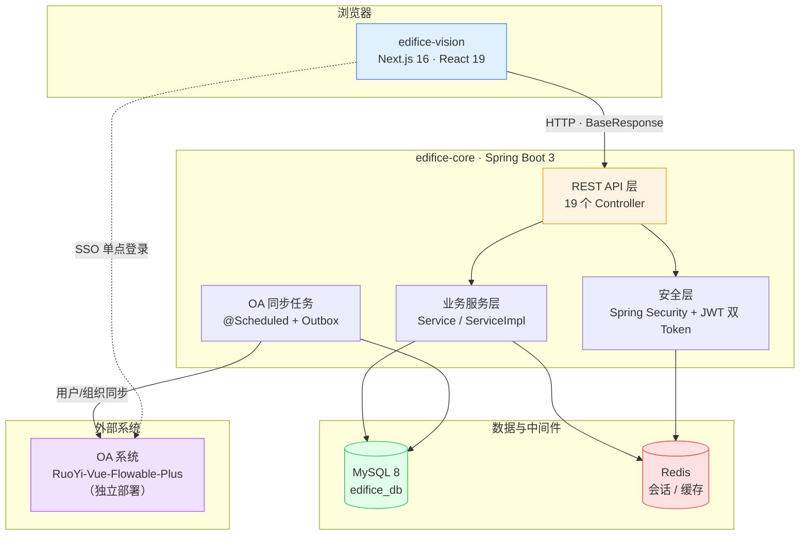
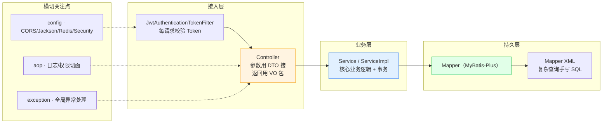
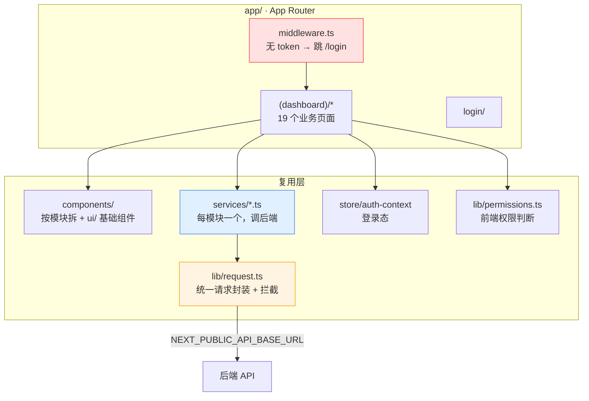
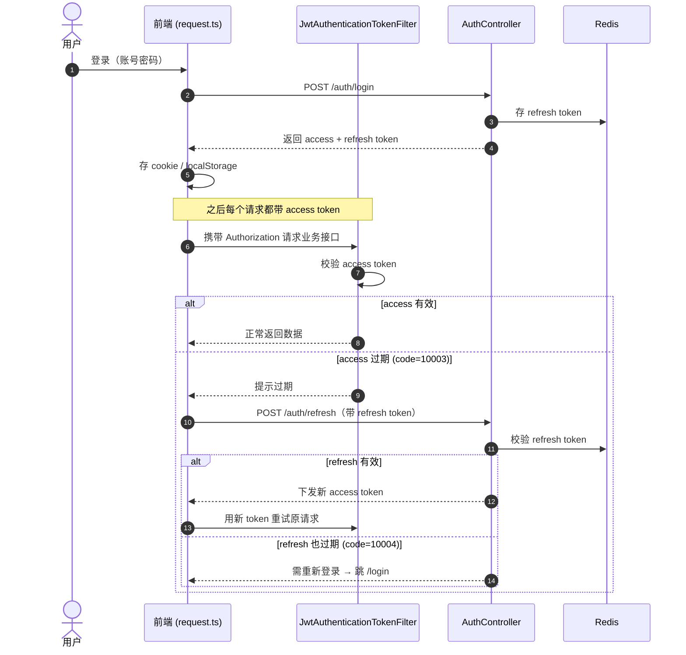
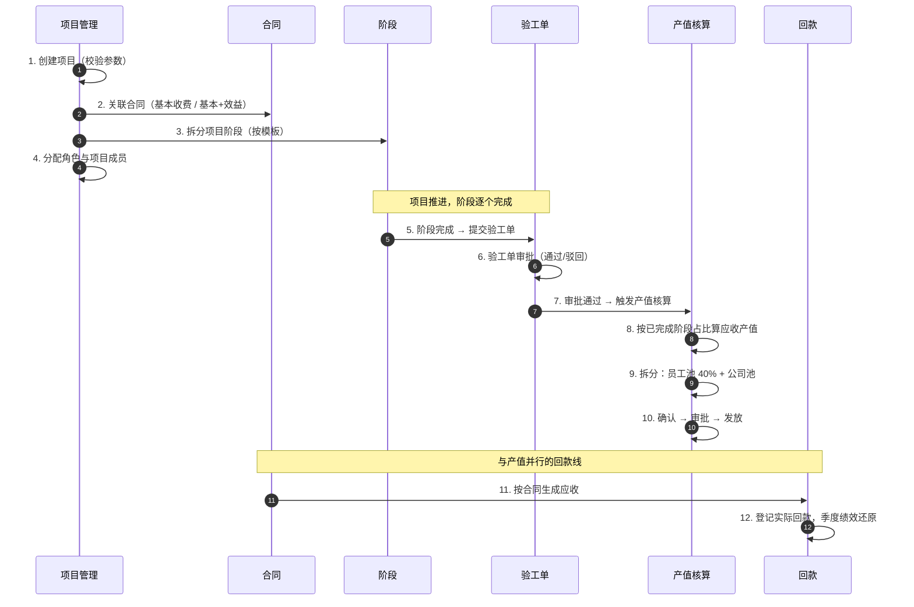
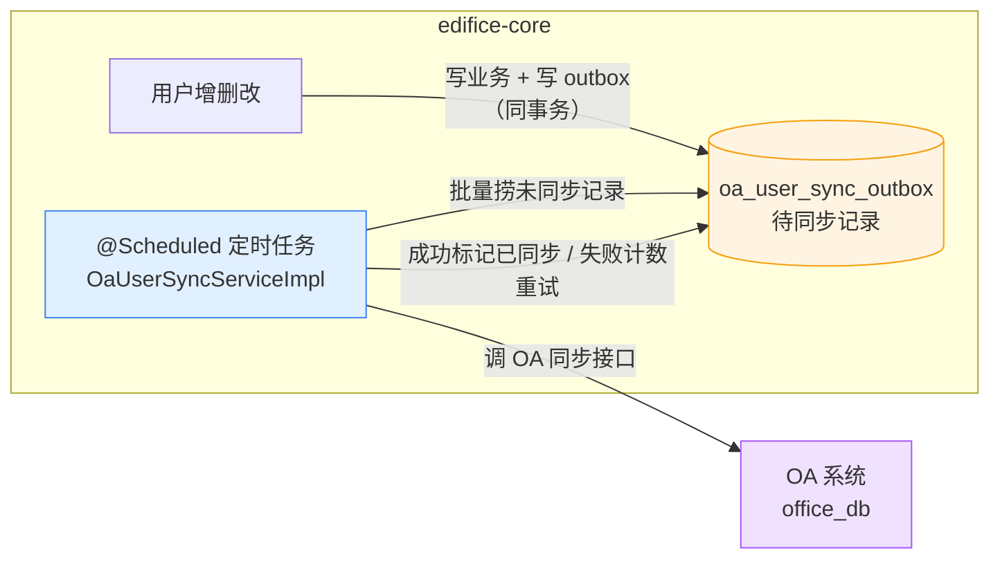

# 架构说明 · Edifice Nexus

> 这份文档讲「系统是怎么搭起来的、各块怎么协作、核心业务怎么流转」。
> 想了解项目是干嘛的、怎么跑起来，看根目录的 [README.md](../README.md)。
> 想了解业务规则细节（产值怎么算），看 [`docs/design/trd/`](design/trd/)。

图都是 Mermaid，GitHub / 大多数 Markdown 预览器能直接渲染。

---

## 1. 系统全景

一句话：**一个 Next.js 前端 + 一个 Spring Boot 后端 + MySQL/Redis**，外加一个**共用用户表的独立 OA 系统**。



**关键点**

- 前后端**彻底分离**，前端只通过 HTTP 调后端，统一响应体是 `BaseResponse<T>`。
- OA 是**另一个独立进程/技术栈**（Vue + Flowable），不和本系统同进程；两边靠**共用用户表 + 后台同步任务**打通，用户在本系统登录后可 SSO 进 OA。
- Redis 同时承担**会话/Token** 和**业务缓存**两个角色。

---

## 2. 后端分层（edifice-core）

经典的 Controller → Service → Mapper 三层，外加横切的安全、AOP、统一异常。



**目录对照**（`apps/edifice-core/src/main/java/com/qsy/edifice/`）

| 包 | 职责 |
| --- | --- |
| `controller/` | REST 接口，入参封装为 `domain/dto`，出参封装为 `domain/vo` |
| `service/` + `service/impl/` | 业务逻辑与事务边界 |
| `mapper/` + `resources/mapper/*.xml` | 数据访问，简单 CRUD 用 MyBatis-Plus，复杂查询写 XML |
| `domain/entity` `dto` `vo` `excel` | 数据库实体 / 入参 / 出参 / Excel 模型 |
| `security/` | Security 配置、JWT 过滤器、登录登出 handler、`OaAwarePasswordEncoder` |
| `config/` | CORS、Jackson、Redis、MyBatis-Plus、WebClient、Web MVC 等配置 |
| `aop/` `exception/` | 切面（日志/权限）、全局异常 |
| `common/` `utils/` `enums/` | 统一响应码（`Code`）、`ResultUtils`、`RedisCache`、各类枚举 |

> 约定（来自 v0.1 TRD）：**接口入参一律封装为 DTO，出参一律封装为 VO**，不要直接把 Entity 透传给前端。

---

## 3. 前端分层（edifice-vision）



**关键约定**

- 页面**只管编排**，真正的接口调用沉在 `services/*.ts`（一个业务模块一个文件，和后端 Controller 对齐）。
- 所有请求走 `lib/request.ts` 统一出口：拼 baseURL、带 Token、统一处理 `BaseResponse` 和错误码。
- 登录态在 cookie（给 `middleware.ts` 用）+ `store/auth-context`（给页面用）里各存一份。

---

## 4. 鉴权流程（双 Token）

后端用 **access token + refresh token** 两个令牌。access 短命，过期了不用重新登录，用 refresh 悄悄换新的。



状态码定义在 `common/Code.java`：`10003` access 过期、`10004` refresh 过期、`40300` 权限不足、`42900` 限流。

---

## 5. 核心业务流：从立项到产值分配

这是整个系统的主线。一个项目从创建到把产值分到人头，大致这么走：



**算账的核心规则**（详见 [v0.4 文档](design/trd/)）

- **基本收费**（`contract_type=0`）：`应收 = base_amount × Σ 已完成阶段产值占比`
- **基本+效益**（`contract_type=1`）：基本部分固定 + 效益部分（按审减额/节约额 × 约定比例）**分阶段累计计入**
- **产值拆分**：员工池占阶段产值 40%（每人约 8.06%，含奖金；降档则 4%，差额归公司），其余进公司池
- ⚠️ 这块逻辑客户口径调整过多次，**改之前一定先读 v0.4**，代码里的实现是规则的"快照"，规则文档才是源头

> 一个项目可能**多个阶段同时进行**（v0.1 TRD 明确强调），算产值时要按"已完成阶段"逐个累加，不能假设阶段是严格串行的。

---

## 6. OA 用户同步

本系统是用户的"权威源"，OA 复用同一批用户。同步用**发件箱（Outbox）模式**保证可靠：用户变更先落一张 outbox 表，再由定时任务推给 OA，失败可重试。



**为什么用 Outbox 而不是直接调**：用户写库和同步 OA 如果分两步直接做，OA 挂了就会数据不一致。Outbox 把"要同步"这件事和业务写在同一个事务里落库，哪怕 OA 暂时不可用，定时任务后面也能补上——最终一致。

相关配置在 `application.yaml` 的 `oa.sync.*`（批大小、重试次数、重试间隔、全量同步周期都可调），代码在 `service/impl/OaUserSyncServiceImpl.java`。

---

## 7. 数据库迁移

```
database/migrations/
├── v1/init_schema.sql          初始建表
└── v2/                         增量迁移（按需顺序执行）
    ├── edifice_menu_permissions.sql        菜单权限
    ├── oa_application.sql                   OA 申请
    ├── oa_application_phase2.sql            OA 申请二期
    ├── oa_org_sync.sql                      组织同步
    ├── oa_user_sync_outbox.sql             用户同步发件箱
    └── output_value_workflow_assignees.sql 产值流程审批人
```

- 没有引入自动迁移框架（Flyway/Liquibase），**靠手工按顺序执行 SQL**。
- 改库表时：在对应版本目录下**新增**一个 SQL 文件，不要改历史文件，方便别人增量同步。

---

## 附：一眼看懂的对照表

| 你想找… | 去哪 |
| --- | --- |
| 某个接口怎么实现的 | `controller/XxxController.java` → `service/impl/XxxServiceImpl.java` |
| 复杂 SQL | `resources/mapper/XxxMapper.xml` |
| 前端某页调了哪些接口 | `app/(dashboard)/xxx/page.tsx` → `services/xxx.ts` |
| 统一返回格式 / 错误码 | `domain/common/BaseResponse.java` / `common/Code.java` |
| 登录鉴权逻辑 | `security/filter/JwtAuthenticationTokenFilter.java` + `config/SecurityConfig.java` |
| 业务规则（产值/回款） | `docs/design/trd/[v0.4]产值核算与回款逻辑闭环.md` |
| OA 集成方案 | `docs/design/trd/[v0.3]OA集成方案-RuoYi-Flowable.md` |
