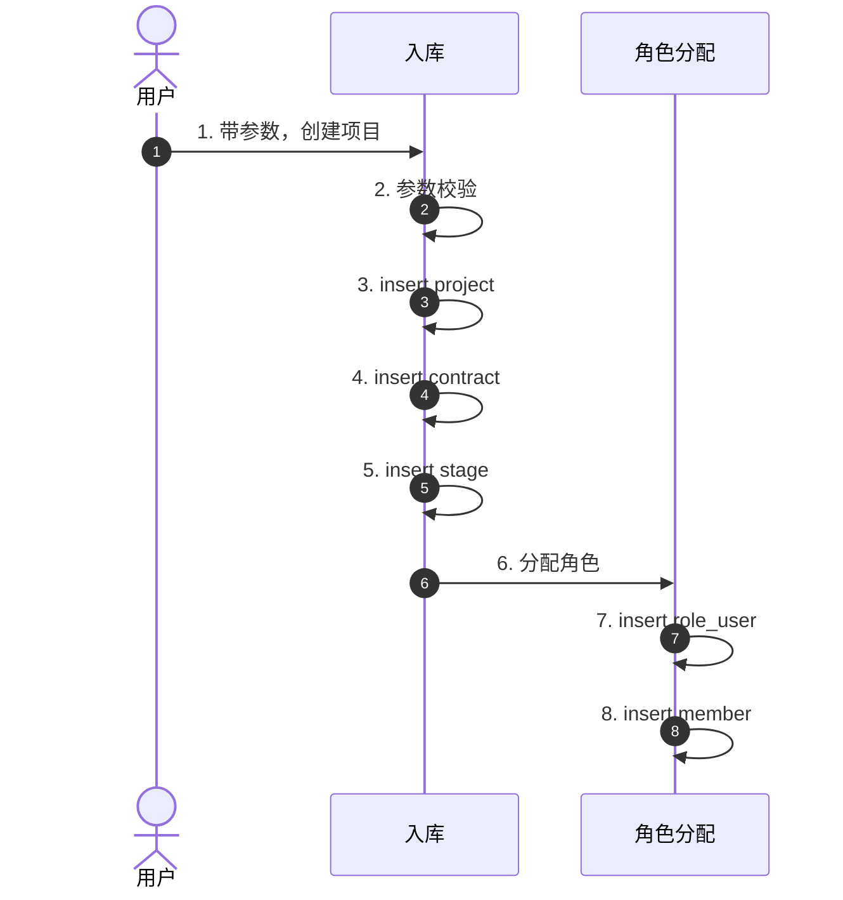
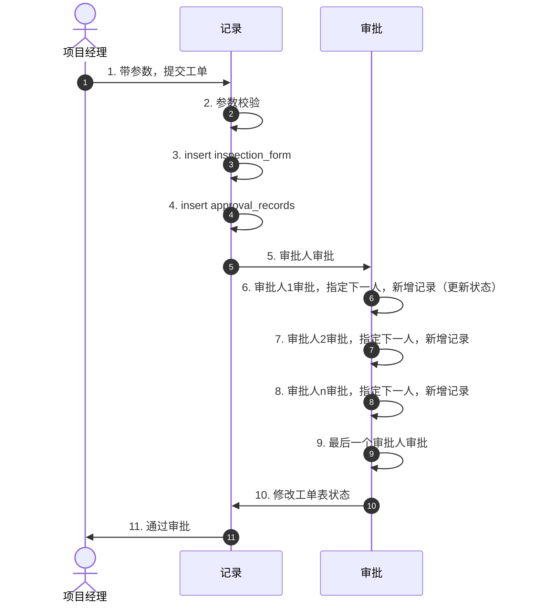

# [v0.1]项目产值分配核算管理系统 - 技术开发文档 part1

## 背景

主要针对项目管理模块进行流程设计


## 目标

完成整个项目模块的逻辑闭环


## 相关资料

github: https://github.com/yannqing/edifice-nexus


## 项目管理

### 整体流程

1. **准备阶段**
   1. **库表设计** 
   2. 建立分支  
   3. 创建实体类，xml，mapper，service 等文件。
2. **业务逻辑开发阶段** 
   1. 封装所有接口入参为 dto
   2. 业务开发
   3. 封装出参为 vo 返回
3. **测试阶段**
   1. 使用 apifox 或 postman 进行接口测试
4. **提交代码阶段**
   1. 更新代码
   2. 推送代码
   3. 提 pr


### 关键集成逻辑




注意：一个项目可能多个阶段同时开始！

### 库表设计

#### 项目表 project

```sql
-- auto-generated definition
create table project
(
    project_id   bigint                             not null comment '项目id'
        primary key,
    project_name varchar(100)                       not null comment '项目名称',
    project_code varchar(100)                       not null comment '项目唯一编码（项目编号）',
    project_type bigint                            not null comment '类型id',
  	project_status tinyint									not null			comment '项目状态：0-未开始/1-进行中/2-待验收/3-验收中/4-已结束',
  	is_show				tinyint		default 1				not null	comment '是否公开：0-不公开/1-公开',
  	project_start_time datetime default CURRENT_TIMESTAMP not null comment '项目开始日期',
  	project_end_time datetime default CURRENT_TIMESTAMP not null comment '项目结束日期',
    created_time    datetime default CURRENT_TIMESTAMP not null comment '创建时间',
    updated_time    datetime default CURRENT_TIMESTAMP null on update CURRENT_TIMESTAMP comment '更新时间',
    is_delete       tinyint  default 0                 not null comment '逻辑删除',
)

comment '项目表';
```


#### 项目类型表 project_type

```sql
-- auto-generated definition
create table project_type
(
    project_type_id   bigint                             not null comment '项目类型id'
        primary key,
    project_type_name varchar(100)                       not null comment '项目类型名称',
    project_code varchar(100)                       not null comment '项目类型唯一编码（项目编号）',
  	project_type_status	tinyint 	default 1				not null		comment '项目类型状态：0-禁用/1-启用'
    created_time    datetime default CURRENT_TIMESTAMP not null comment '创建时间',
    updated_time    datetime default CURRENT_TIMESTAMP null on update CURRENT_TIMESTAMP comment '更新时间',
    is_delete       tinyint  default 0                 not null comment '逻辑删除',
)

comment '项目类型表';
```


#### 项目成员表 project_member

```sql
-- auto-generated definition
create table project_member
(
    project_member_id   bigint                             not null comment '项目成员id'
        primary key,
    project_id bigint                       not null comment '项目id',
    user_id bigint                       not null comment '用户id',
    project_role	bigint										not null	comment '项目内角色id',
    created_time    datetime default CURRENT_TIMESTAMP not null comment '创建时间',
    updated_time    datetime default CURRENT_TIMESTAMP null on update CURRENT_TIMESTAMP comment '更新时间',
    is_delete       tinyint  default 0                 not null comment '逻辑删除',
)

comment '项目成员表';
```


#### 合同表 contract

```sql
-- auto-generated definition
create table contract
(
    contract_id   bigint                             not null comment '合同id'
        primary key,
    contract_name varchar(100)                       not null comment '合同名称',
    contract_code varchar(100)                       not null comment '合同唯一编码（项目编号）',
  	contract_type	tinyint				default 0						not null comment '合同类型：0-基本收费/1-基本+效益',
  	contract_amount int																null	comment '合同金额',
  	contract_file	bigint								not null				comment '合同主文件id',
  	contract_other_files	json												null	comment '合同其他附件(id json 数组)',
,  	base_amount			int																	null comment '基本收益金额',
  	benefit_rules		varchar(255)										null			comment '效益收益规则',
  	signing_date		datetime	default CURRENT_TIMESTAMP not null comment '项目签订日期',
  	pre_start_date datetime	default CURRENT_TIMESTAMP	not null comment '项目预计开始日期',
  	pre_end_date datetime	default CURRENT_TIMESTAMP	not null comment '项目预计结束日期',
    created_time    datetime default CURRENT_TIMESTAMP not null comment '创建时间',
    updated_time    datetime default CURRENT_TIMESTAMP null on update CURRENT_TIMESTAMP comment '更新时间',
    is_delete       tinyint  default 0                 not null comment '逻辑删除'
)
comment '合同表';
```


#### 项目阶段表 project_stage

```sql
-- auto-generated definition
create table project_stage
(
    project_stage_id   bigint                             not null comment '项目阶段id'
        primary key,
    project_id bigint                      not null comment '项目id',
  	stage_name	  varchar(255)						not null		comment '阶段名称',
  	stage_status	tinyint			default 0		not null	comment '阶段状态：0-未开始/1-进行中/2-待验收/3-已验收/4-已驳回/5-待分配/6-已完成',
  	stage_output	decimal(10, 2) default 0.00 not null	comment '阶段产值比例',
    created_time    datetime default CURRENT_TIMESTAMP not null comment '创建时间',
    updated_time    datetime default CURRENT_TIMESTAMP null on update CURRENT_TIMESTAMP comment '更新时间',
    is_delete       tinyint  default 0                 not null comment '逻辑删除',
)
	comment '项目阶段表';
```


#### 项目阶段模版表 project_stage_template

```sql
-- auto-generated definition
create table project_stage_template
(
    stage_id   bigint                             not null comment '阶段id'
        primary key,
  	stage_name	  varchar(255)						not null		comment '阶段名称',
  	stage_output	decimal(10, 2) default 0.00 not null	comment '阶段默认产值比例',
  	stage_status 	tinyint		default 1				not null		comment '阶段状态：0-禁用/1-启用',
    created_time    datetime default CURRENT_TIMESTAMP not null comment '创建时间',
    updated_time    datetime default CURRENT_TIMESTAMP null on update CURRENT_TIMESTAMP comment '更新时间',
    is_delete       tinyint  default 0                 not null comment '逻辑删除',
);
```


#### 项目文件表 project_files

```sql
-- auto-generated definition
create table project_files
(
    project_file_id          bigint 	not null											comment `项目文件id`
        primary key,
    project_id   varchar(64)                        null comment '项目id',
  	project_stage_id	bigint			not null					comment '项目阶段id',
  	file_id			bigint						not null				comment '文件id',
    created_time    datetime default CURRENT_TIMESTAMP not null comment '创建时间',
    updated_time    datetime default CURRENT_TIMESTAMP null on update CURRENT_TIMESTAMP comment '更新时间',
    is_delete       tinyint  default 0                 not null comment '逻辑删除',
)
    comment '项目文件表';
```


### API 设计

#### 新建项目

功能描述：新建项目，以及初始化各个数据

请求方法与路径 `POST /project/create` 

入参：

| 字段           | 类型          | 是否必填 | 说明                           |
| -------------- | ------------- | -------- | ------------------------------ |
| projectName    | String        | 是       | 项目名称                       |
| projectCode    | String        | 否       | 项目编码（如果为空，自动生成） |
| projectType    | Integer       | 是       | 项目类型                       |
| contractType   | Integer       | 是       | 合同类型                       |
| contractAmount | Double        | 是       | 合同金额                       |
| baseAmount     | Double        | 否       | 基础金额                       |
| benefitRule    | String        | 否       | 效益规则                       |
| projectCharges | List<Integer> | 是       | 项目经理                       |
| projectMember  | List<Integer> | 否       | 项目成员                       |
| signingTime    | LocalDateTime | 否       | 签订日期                       |
| preStartTime   | LocalDateTime | 否       | 预计开始日期                   |
| preEndTime     | LocalDateTime | 否       | 预计结束日期                   |


#### 查询本人参与项目

功能描述：分页 + 条件查询所有符合要求的项目

请求方法与路径 `GET /project/mine` 

入参：

| 字段          | 类型    | 是否必填 | 说明           |
| ------------- | ------- | -------- | -------------- |
| keywords      | String  | 否       | 项目名称或编号 |
| projectStatus | Integer | 否       | 项目状态       |


出参List<ListVo>：

| 字段           | 类型          | 是否必填 | 说明                           |
| -------------- | ------------- | -------- | ------------------------------ |
| projectName    | String        | 是       | 项目名称                       |
| projectCode    | String        | 是       | 项目编码（如果为空，自动生成） |
| projectType    | Vo            | 是       | 项目类型                       |
| projectStatus  | Integer       | 是       | 项目状态                       |
| projectStage   | Vo            | 是       | 项目阶段                       |
| contractAmount | Double        | 是       | 合同金额                       |
| projectMember  | List<ListVo>  | 是       | 项目成员列表（包含项目经理）   |
| preStartTime   | LocalDateTime | 是       | 预计开始时间                   |
| preEndTime     | LocalDateTime | 是       | 预计结束时间                   |


#### 根据id查询项目详情

功能描述：查看项目详情信息（查看自己参与的项目）

请求方法与路径：`GET /project/details/{id}` 

入参：项目 id

出参：DetailVo

| 字段           | 类型          | 是否必填 | 说明                           |
| -------------- | ------------- | -------- | ------------------------------ |
| projectName    | String        | 是       | 项目名称                       |
| projectCode    | String        | 是       | 项目编码（如果为空，自动生成） |
| projectType    | Vo            | 是       | 项目类型                       |
| projectStatus  | Integer       | 是       | 项目状态                       |
| projectStage   | Vo            | 是       | 项目阶段                       |
| contractAmount | Double        | 是       | 合同金额                       |
| projectMember  | List<ListVo>  | 是       | 项目成员                       |
| preStartTime   | LocalDateTime | 是       | 预计开始时间                   |
| preEndTime     | LocalDateTime | 是       | 预计结束时间                   |


#### 查询所有项目

功能描述：给所有成员查看的项目信息

请求方法与路径：`GET /project/all` 

入参：

- 项目名称或编号
- 分类
- 状态
- 负责人

出参：与上面本人参与项目保持一致


#### 项目信息统计总览

功能描述：对项目进行统计，用于“全部项目”页

请求方法与路径：`GET /project/all/statistics` 

入参：无

出参：

- 项目总数
- 进行中的数量
- 待验收的数量
- 已完成的数量
- 合同总额


#### 导入项目


#### 导出项目


## 验工审批

### 整体流程

1. 准备阶段

- 确保项目本阶段已经完成

2. 核心阶段

- **项目经理**提交验工单
- 然后后面进行审核


### 关键集成逻辑




### 库表设计

#### 验工单表 inspection_form

```sql
-- auto-generated definition
create table inspection_form
(
    inspection_form_id          bigint 	not null											comment `验工单id`
        primary key,
  	inspection_form_code			varchar(255)					not null comment '验工单编号',
    project_id   varchar(64)                     not   null comment '项目id',
  	project_stage_id	bigint			not null					comment '项目阶段id',
  	inspection_form_description		varchar(1024)			null comment '验工说明',
  	apply_user_id					bigint			not null			comment '申请人id',
  	inspection_form_status			tinyint 										comment '验工单状态：0-待审核/1-审核中/2-已驳回/3-已通过/4-草稿',
  	file_ids			json						not null				comment '附件id（json数组）',
    created_time    datetime default CURRENT_TIMESTAMP not null comment '创建时间',
    updated_time    datetime default CURRENT_TIMESTAMP null on update CURRENT_TIMESTAMP comment '更新时间',
    is_delete       tinyint  default 0                 not null comment '逻辑删除',
)
    comment '验工单表';
```


#### 审批记录表 approval_records

```sql
-- auto-generated definition
create table approval_records
(
    approval_record_id          bigint 	not null											comment `审批记录id`
        primary key,
  	approval_record_type		tinyint 							not null	comment '审批类型：0-项目文件上传/1-验工审批/2-产值分配审批/3-工时填写'
  	inspection_form_id			bigint					not null comment '对应业务id',
  	approver					bigint			not null			comment '审批人id',
  	approver				varchar(1024)			null			comment '审批说明',
  	inspection_form_status			tinyint 										comment '审批状态：0-待审核/1-已通过/2-已拒绝',
    created_time    datetime default CURRENT_TIMESTAMP not null comment '创建时间',
    updated_time    datetime default CURRENT_TIMESTAMP null on update CURRENT_TIMESTAMP comment '更新时间',
    is_delete       tinyint  default 0                 not null comment '逻辑删除',
)
    comment '审批记录表';
```


### API 设计


#### 提交验工单

功能描述：项目阶段完成，项目经理提交验工单

请求路径和方法：`POST /inspections/apply`


#### 验工单审批

功能描述：审批验工单

请求路径和方法：`PUT /inspections/approval`


#### 查看我的验工单列表

功能描述：查看和本人有关的验工单列表

请求路径和方法：`GET /inspections/my-list`


#### 根据id 查看验工单详情

功能描述：点击按钮，查看单个验工单详情

请求路径和方法：`GET /inspections/{id}`


#### 验工单数据总览

功能描述：在验工审批页面，上面有统计数据

请求路径和方法：`GET /inspections/my-list/statistic`


#### 导出我的验工单

功能描述：把与我有关的验工单导出为 excel 表

请求路径和方法：`POST /inspections/my-list/export`

